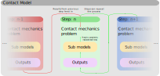
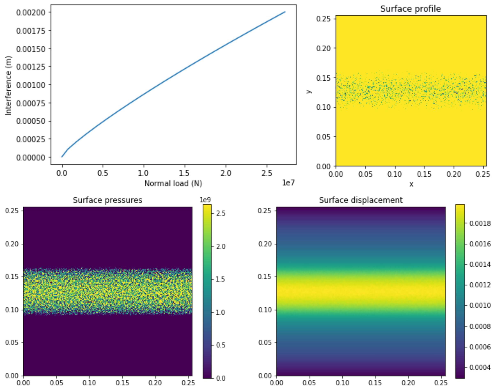

========
|SlipPY|
========

|pypi| |citest| |docs|

.. |SlipPY| image:: logo.svg
        :target: https://github.com/FrictionTribologyEnigma/slippy
        :alt: Slippy

.. |pypi| image:: https://img.shields.io/pypi/v/slippy.svg
        :target: https://pypi.python.org/pypi/slippy

.. |citest| image:: https://img.shields.io/travis/FrictionTribologyEnigma/slippy.svg
        :target: https://travis-ci.com/FrictionTribologyEnigma/slippy

.. |docs| image:: https://readthedocs.org/projects/slippy/badge/?version=latest
        :target: https://slippy.readthedocs.io/en/latest/?badge=latest
        :alt: Documentation Status

A python package for tribologists. Including:

- surface analysis and generation:
    - multiple random surface generation methods
    - easy integration with alicona and .csv files
    - easy generation of common surface shapes for modelling
- boundary element normal contact analysis:
    - CPU and GPU back ends available
    - easily extendable system for custom behaviour
    - simple user interface allowing the user to build complex models
- mixed lubrication modelling with user defined non newtonian fluids

Installation
============
To install slippy, you need to have python installed. If you are not familiar with python, we recommend installing the
anaconda_ distribution, as it comes with many other useful tools. We also recommend installing slippy in a virtual
environment. If you are using anaconda you can create a suitable virtual environment, install python and pip, and
activate the environment, by running the following in the **anaconda prompt**:

.. code-block:: bash

    conda create -n name_of_env python==3.8 pip
    conda activate name_of_env

Once activated, you should see the name of the environment in brackets in the command prompt. Packages are only
installed for the currently active environment. When you have python and pip installed there are two ways to install
slippy:

From PyPI_:
-----------
The last released version can be installed from the python package index PyPI:

.. code-block:: bash

    python -m pip install slippy

From github:
------------
The latest version can be installed from github, this version will gain functionality first but may be unstable during
development:

.. code-block:: bash

    python -m pip install git+https://github.com/FrictionTribologyEnigma/slippy.git@master

**If you are working on linux you may have to replace 'python' with 'python3' in the installation commands.**

You are now ready to run models using CPU backend, if you are unfamiliar with slippy a good place to start would be the
examples folder in the github repository, these show working code examples for some common problems. They can be viewed
online or downloaded and run locally. Running locally requires you to install jupyter ('python -m pip install jupyter'
in anaconda prompt) in the same environment as slippy is installed in. You can then start a notebook server ('jupyter
notebook' in anaconda prompt) and open the .ipynb file through the webpage this opens.

Installing the GPU backend:
---------------------------
Slippy can run simulations on Nvidia GPUs, this is often much faster for large simulations. However, this
functionality is not possible on all computers. Because of this we don't attempt to install the GPU backend with the
requirements as this would make it impossible for many users to install slippy. In order to run models on the GPU you
must also install cupy_, instructions for installing cupy can be found here_. This step is optional, if cupy is
installed slippy will use the GPU by default, otherwise it will use the CPU backend.

Citation
========
We are working on a paper to cite if you find slippy useful, please also check documentation of the functions you use,
to ensure credit goes to the original authors.

Example usage
=============
Many detailed examples are available in the examples directory in the github repository. However most contact models
will follow a standard work flow:

- Define surface profiles either by reading from file or generating
- If a profile has been read from file, fill in missing data
- Define materials and assign then to the surfaces
- Make a contact model object to coordinate the solution
- Make modelling steps which describe the problem you need to solve
- Add the steps to the model
- Add sub models to the steps as required
- Add output requests to the steps as required
- Check and solve the model
- Post process the results

In this simple example a rough cylinder is pressed into a flat plane, materials are elastic but with a maximum
allowable pressure to simulate an elastic perfectly plastic material. Where the loads is equal to this maximum load
the surfaces are allowed to penetrate each other, here a wear sub-model is used to remove this overlap as wear, this
permanently changes the surface profiles.

A more detailed description of the decisions behind the code can be found in the example_:

.. code-block:: python

    import numpy as np
    import slippy.surface as s
    import slippy.contact as c
    # define contact geometry
    cylinder = s.RoundSurface((1 ,np.inf, 1), shape=(256, 256), grid_spacing=0.001)
    roughness = s.HurstFractalSurface(1, 0.2, 1000, shape=(256, 256), grid_spacing=0.001,
                                      generate = True)
    combined = cylinder + roughness * 0.00001
    flat = s.FlatSurface(shape=(256, 256), grid_spacing=0.001, generate = True)

    # define material behaviour and assign to surfaces
    yield_stress = 3 * np.exp(0.736 * 0.3) * 705e6
    material = c.Elastic('steel', properties = {'E':200e9, 'v':0.3},
                         max_load = yield_stress)
    combined.material = material
    flat.material = material

    # make a contact model
    my_model = c.ContactModel('qss_test', combined, flat)

    # make a modelling step to describe the problem
    max_int = 0.002
    n_time_steps = 20
    my_step = c.QuasiStaticStep('loading', n_time_steps, no_time=True,
                                interference = [max_int*0.001, max_int],
                                periodic_geometry=True, periodic_axes = (False, True))

    # add the steps to the model
    my_model.add_step(my_step)

    # add sub models
    wear_submodel = c.sub_models.WearElasticPerfectlyPlastic('wear_l', 0.5, 0.5, True)
    my_step.add_sub_model(wear_submodel)

    # add output requests
    output_request = c.OutputRequest('Output-1',
                                     ['interference', 'total_normal_load',
                                      'loads_z', 'total_displacement_z',
                                      'converged'])
    my_step.add_output(output_request)

    # solve the model
    final_result = my_model.solve()

Some examples of results which could be generated from the output of this model are shown below:

|results|

Solution Details
================
The process of generating a contact model can be difficult to understand, however the process slippy works through in
solving a model is relatively simple. For each model step, first any offset (tangential motion) between the surfaces
is applied. Next the contact mechanics problem is solved, this should include any processes which need to be two way
coupled, for example fluid pressures and deformation in a EHL step.

After this the sub-models are solved, these are one way coupled to the contact mechanics problem in this time step.
This means that the result of the contact model can be used in their solution but they cannot impact the solution of
the contact mechanics problem in a single time step. Processes like wear, film growth, temperature change, and in some
cases tangential contact can be solved in sub-models.

Finally the requested outputs are written to file so they can be post processed at a later time. Depending on the step
this process can repeat for the same step or the model can move on to the next step:

|solution|

Documentation
=============
We are working on a detailed documentation website, for now there are detailed documentation strings with each function
or class and examples_ for common problems. If you find these examples or documentation lacking, please consider
contributing to the development of the documentation, your experience of using the functions without having developed
them is invaluable as an indication of the problems new users are likely to face.

Contributing
============
We welcome contributions in many forms. Please see the contributing_ page for more information

Credits
=======

This package was created with Cookiecutter_.

.. _Cookiecutter: https://github.com/audreyr/cookiecutter
.. _cupy: https://docs.cupy.dev/en/stable/overview.html
.. _here: https://docs.cupy.dev/en/stable/install.html
.. _anaconda: https://www.anaconda.com/
.. _pip: https://pypi.org/project/pip/
.. _PyPI: https://pypi.org/project/slippy/
.. _example: https://github.com/FrictionTribologyEnigma/SlipPY/blob/master/examples/Quasi%20Static%20Steps%20-%20Normal%20contact%20with%20movement.ipynb
.. _contributing: https://github.com/FrictionTribologyEnigma/SlipPY/blob/master/CONTRIBUTING.rst
.. _examples: https://github.com/FrictionTribologyEnigma/SlipPY/blob/master/examples
